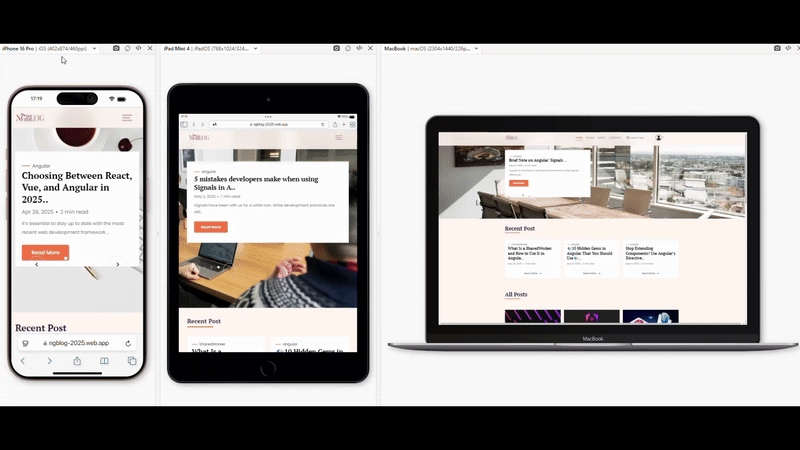
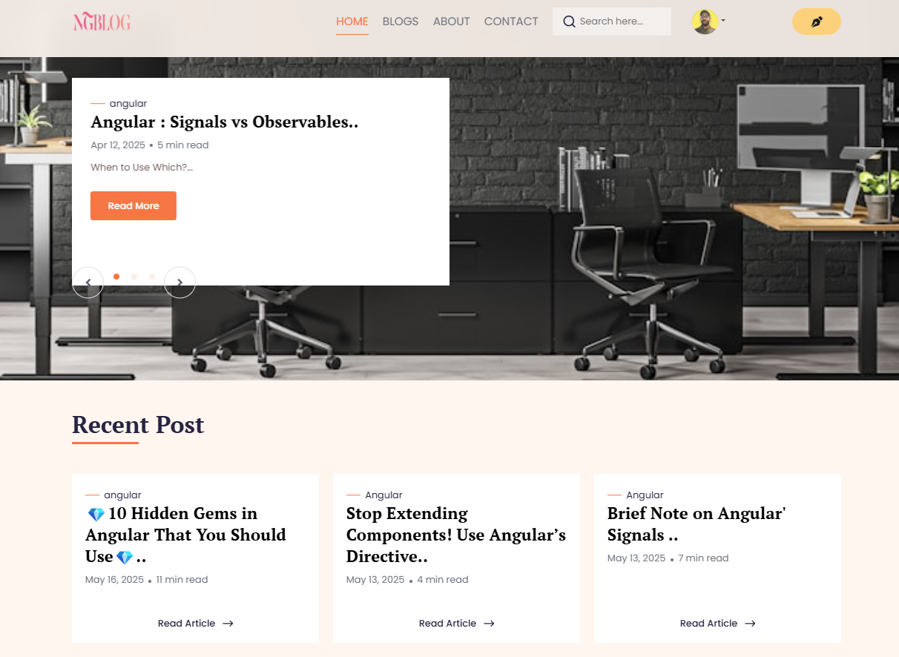
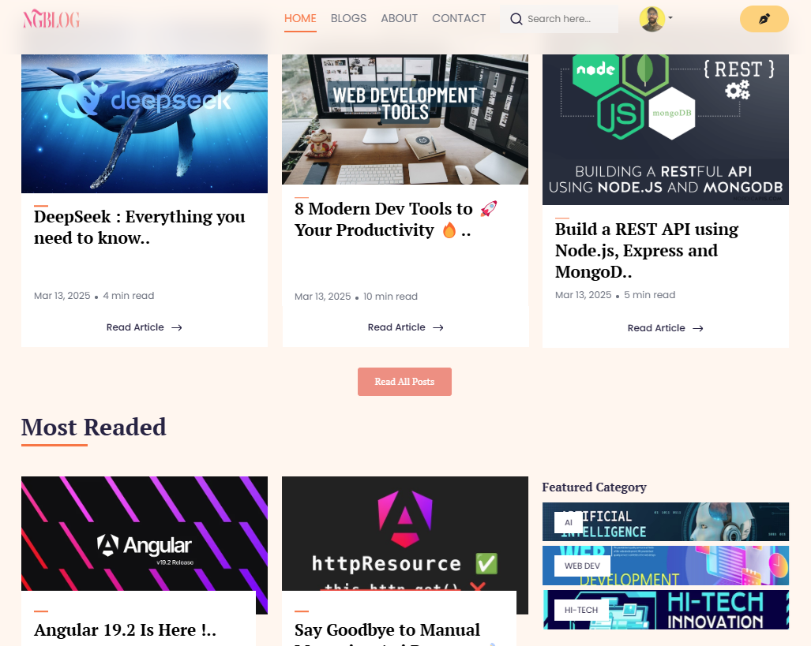
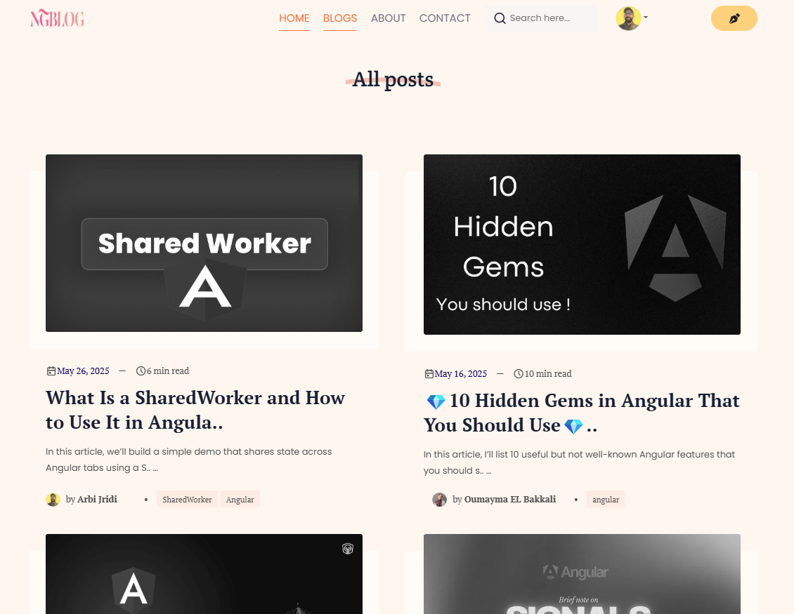
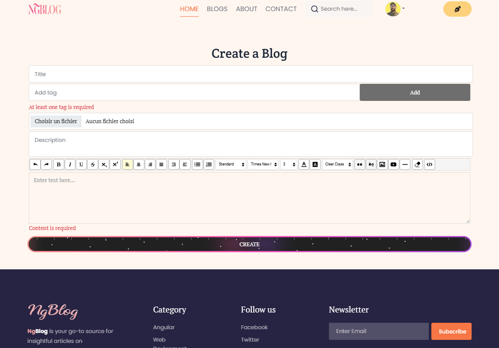
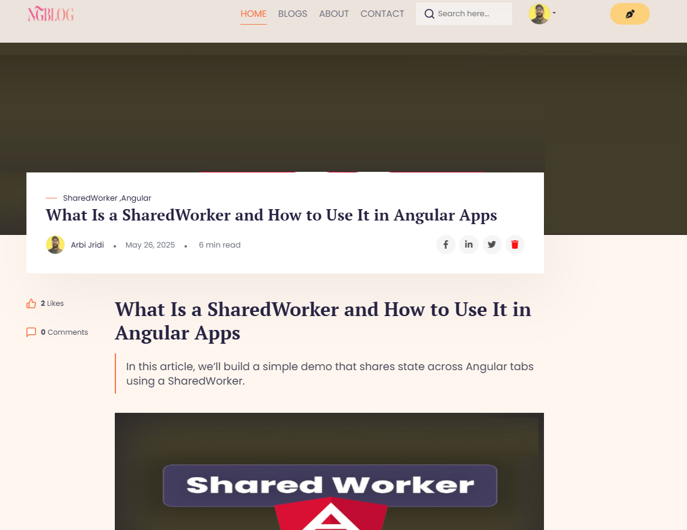
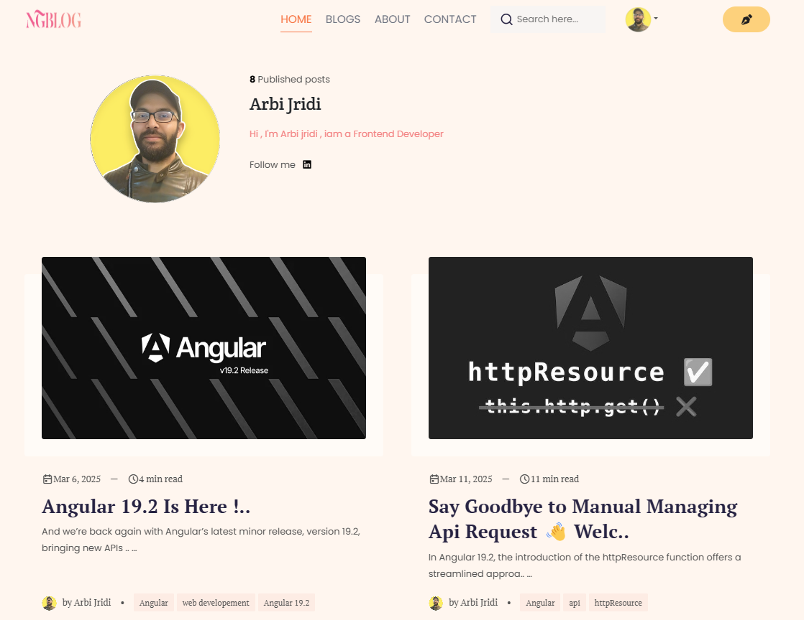

<H1 align="center">

🪶 NGblog 🪶

 </H1>
<div align="center">
  
 </div>
 
 <h3 align="center">📝 A MEAN Stack Blog App 📝</h4>


<H1>
 overview
 </H1>

<!-- TABLE OF CONTENTS -->
<details>
  <summary>Table of Contents</summary>
  <ol>
    <li>
      <a href="#about-the-project">About The Project</a>
      </li>
        <li><a href="#Tech-Stack🚀">Tech Stack🚀</a></li>
    <li>
      <a href="#Features">Features</a>
    </li>
    <li>
      <a href="#🛠️-getting-started">Getting Started</a>
      <ul>
        <li><a href="#prerequisites">Prerequisites</a></li>
        <li><a href="#installation">Installation</a></li>
      </ul>
    </li>
    <li><a href="#📸-demo">Demo</a></li>
    <li><a href="#📸-screenshots">Screenshots</a></li>
    <li><a href="#🤖-magic-under-the-hood">Magic Under the Hood</a></li>
    <li><a href="#👨‍💻-author">Author</a></li>
    <li><a href="#📄-license">License</a></li>
  </ol>
</details>

</br>

</hr>


## About The Project

 <div align="center">
  
  
  
  
</div>


<p align="center">
  <b>A modern, full-featured blog platform built with the MEAN stack (MongoDB, Express, Angular, Node.js).</b><br>
  <i>Includes authentication, authorization, JWT, CRUD, comments, likes, and reactive state management with NgRx Signals!</i>
</p>


<br />
<div align="center">


  <p align="center">
   ........
    <br />
    <a"><strong>Explore the docs</strong></a>
    <br />
    <br />
    <a href="https://ngblog-2025.web.app">View Demo</a>
    &middot;&nbsp;
    <a href="https://github.com/arbi-jridi/ngBlog/issues/new/choose">Report Bug</a>
    &middot;&nbsp;
    <a href="https://github.com/arbi-jridi/ngBlog/compare">Request Feature</a>
  </p>
</div>


---

## Tech-Stack🚀

**Frontend:**
- 
- 
- 
- 
- 

**Backend:**
- 
- 
- 
- 

---

## Features

- 🅰️ **Angular 19**
- ✅ **Nodejs 20**
- 🔗 **Express.js**
- 📦 **Database : MongoDB**
- 🛡️ **JWT Authentication**
- 📦 **Media Storage: CLOUDINARY API**
- 🔐 **Authentication & Authorization (Register, Login, JWT-protected routes)**
- 📝 **CRUD Operations :Create, Edit,Update and Delete Blogs**
- ⬆️ **File/image/Audio/Video/youtube_links Upload and integration in the Blog**
- 📇 **Kolkov Angular Text Editor with code detection !**
- 👍 **Like/Unlike Blogs**
- 💬 **Comment on Blogs**
- 🛡️ **Role-based Access Control**
- 🕵️ **Secure API Endpoints**
- 📦 **State Management with NgRx / Signals**
- 🔄 **Reactive UI with Angular**
- 📃 **Pagination / Routing / Filtering / AuthGuard**
- 🔍 **Search Blogs**
- 📂 **Blog Categories and tags**
- 🔄 **Sharing Blogs on social media**
- 👤 **User Profiles**
- 📅 **Timestamps & Activity Tracking**
- 💻|⬛|📱 **Responsive Design**

---

## 🛠️ Getting Started

### Prerequisites
- VScode
- Git
- Node.js & npm
- Angular CLI 19
- MongoDB | Atlas | Local Compass
- Cloudinary API
- Postman 
- Vercel | Heroku | Firebase | Netlify | Cloudflare | Render | ...


### Installation

1. **Clone frontend the repository & install it :**
   ```bash
   # Install frontend dependencies
   git clone https://github.com/arbi-jridi/ngBlog.git
   npm install

2. **Clone & install backend dependencies:**
   
   ```bash
   # Install backend dependencies
   git clone https://github.com/arbi-jridi/ngblog-backend.git
   cd backend
   npm install
   ```

   - Frontend:
     # Navigate to frontend directory
     ```bash
     cd ../frontend
      ```
     # Install frontend dependencies
     ```bash
     npm install
      ```
     
3. Configure environment variables:
   
   - Set up your MongoDB URI and JWT secret in the backend .env file.
4. Run the app:
   
   - Start MongoDB server.
   - Backend:
     ```bash
     npm start
     ```
   - Frontend:
     ```bash
     ng serve
     ```
5. Visit: http://localhost:4200

## 📸 Demo

## 📸 Screenshots








## 🤖 Magic Under the Hood
- JWT Authentication: Secure, stateless user sessions.
- NgRx Signals: Lightning-fast, reactive state management for a seamless UX.
- RESTful API: Clean, modular Express routes.
- MongoDB: Flexible, scalable data storage.
- Angular Animations: Smooth transitions and feedback.
- Optimized for Production: Ready for deployment on Heroku, Vercel,firebase.. or your favorite cloud.
## 👨‍💻 Author
- Arbi Jridi - https://github.com/arbi-jridi
## 📄 License
This project is licensed under the MIT License.

Made with ❤️ using the MEAN stack. Happy blogging!


**What’s changed and why:**

- Updated the stack to reflect Angular, Node.js, Express, MongoDB.

- Added modern features: JWT, CRUD,

comments, likes, NgRx Signals.

- Improved formatting, badges, and

sections for clarity and professionalism.

- Included setup instructions,

screenshots, and author/license sections.

- Removed references to unrelated

technologies (Angular,Nodejs,Express,Mongodb...).

Feel free to further personalize it !

<hr>


